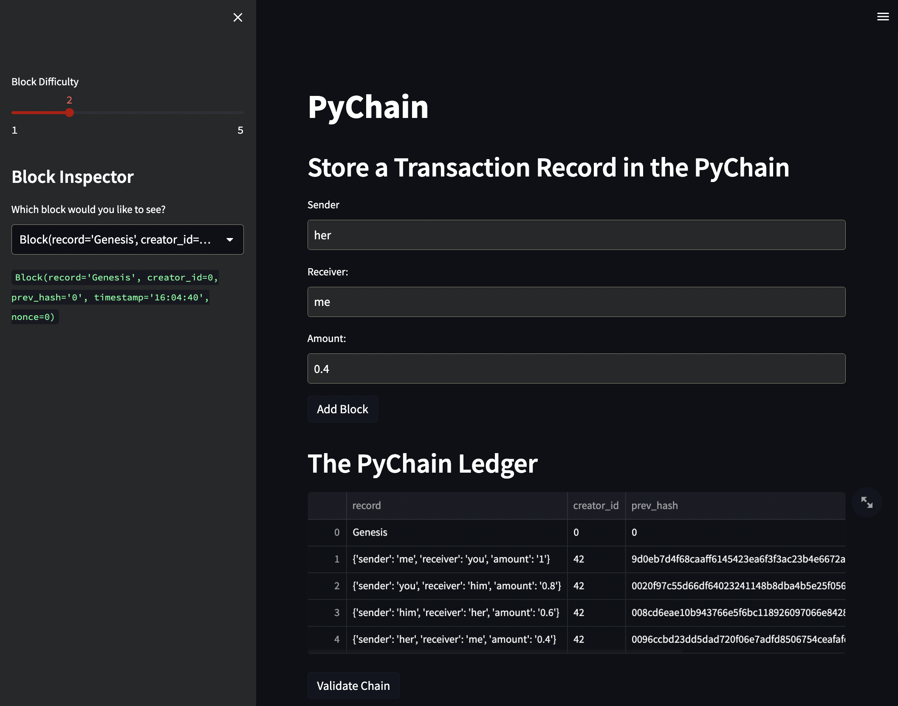
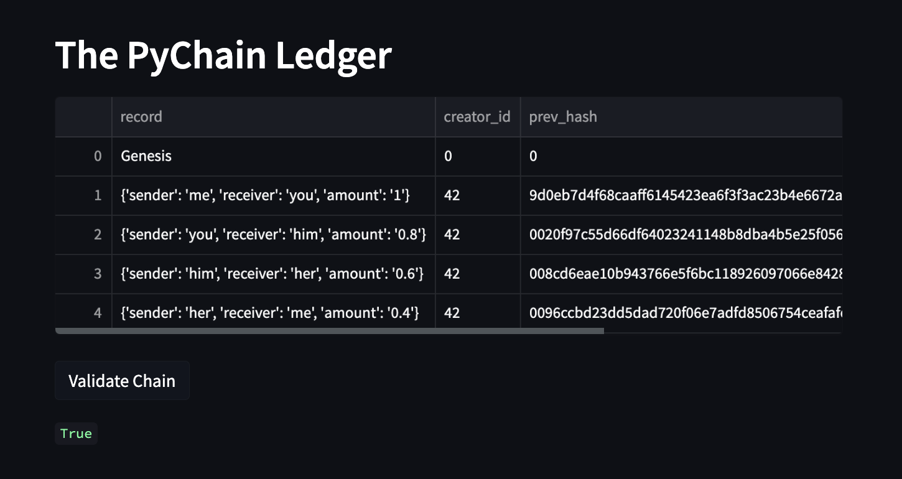

# Pychain Ledger

Unit 18 Assignment

## Streamlit Application

Deployed online with Streamlit: [streamlit.app](https://juil-pychainledger-pychain-5di3td.streamlit.app/)

### Validation

The application can validate the ledger by comparing each block's hash to the next block's `prev_hash`.

## Code

* Using starter code for `pychain.py` provided by *edX Boot Camps*
